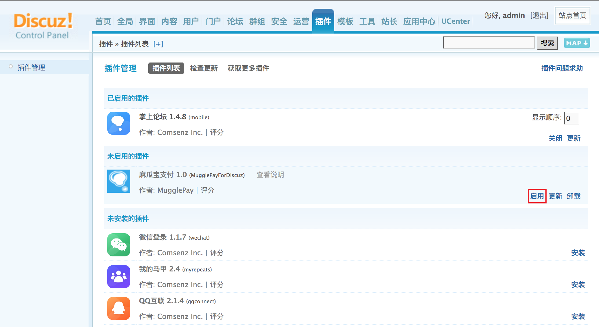
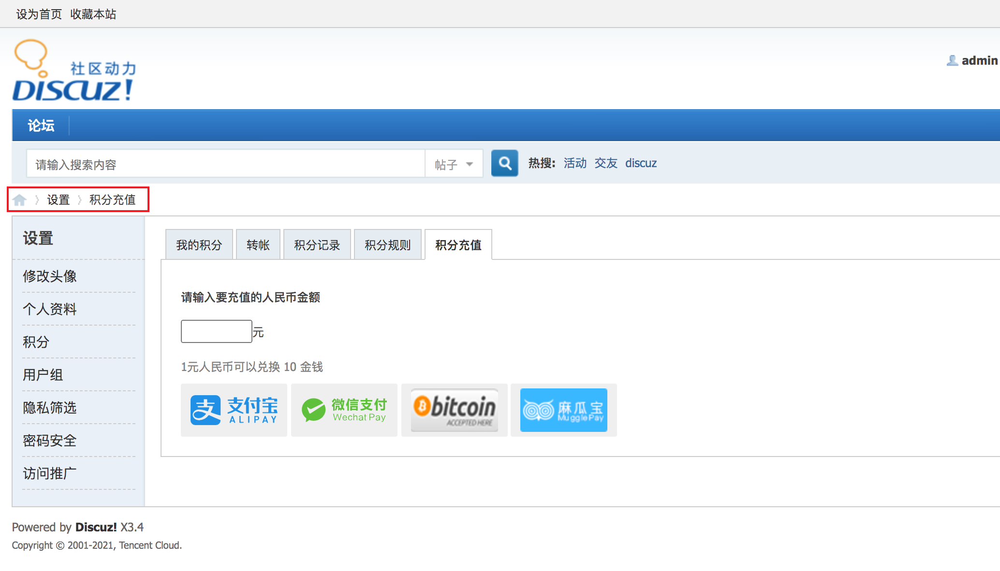

# Discuz麻瓜宝支付插件

### 说明
+ 本插件基于Discuz！ X3.4开发，理论上支持X3.x，并没有完全测试，仅仅测试X3.3与X3.4，其他版本还需自行测试。
+ 请使用UTF-8编码格式，如果您的论坛采用GBK文件编码，请自行转换。

### 安装及使用教程
+ 上传至 source/plugin 文件夹，保持目录名为MugglePayForDiscuz

+ 在Discuz管理后台中安装并启用

+ 注册麻瓜支付商家账号，https://merchants.mugglepay.com/，在 开发者中心 - 密钥管理 中生成密钥。

+ 将麻瓜支付提供的后台密钥，填写至插件内，设置交易积分类型及兑换比例，即可使用。

+ 注意：如需开启微信支付或支付宝，请在麻瓜支付商家后台 收款设置 - 法币收款 中提交申请。

+ 用户在 设置 - 积分充值 页面可以使用麻瓜支付充值啦，充值成功会收到论坛消息提醒，并可在 设置 - 我的积分 中查看记录

**注意：由于本插件没有对接退款API，一旦用户支付不可退回款项，请悉知！**

